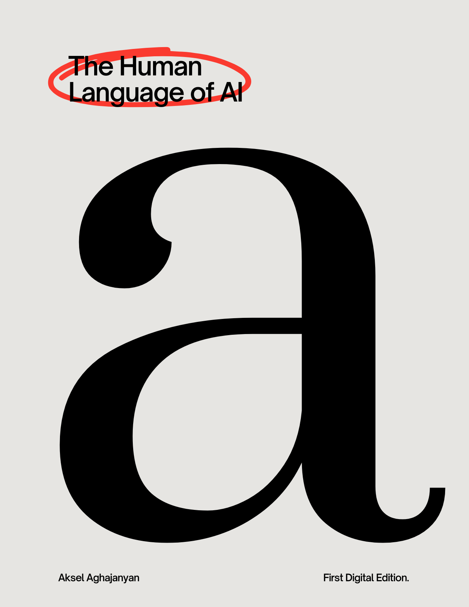

<div align="center">



# The Human Language of AI

**First Digital Edition**

[](https://creativecommons.org/licenses/by-nc-sa/4.0/)
[](./main.pdf)
[]()
[](https://github.com/Aksel588/The-Human-Language-of-Al/stargazers)

*"The most profound thing about AI is not that it speaks — but that it has learned to listen."*

</div>

---

## About

**The Human Language of AI** explores the intersection between human natural language and artificial intelligence. It traces the journey from how humans use language to communicate, to how modern AI systems understand, generate, and engage with human speech and text.

Written for curious readers, students, researchers, and technology enthusiasts — this book offers accessible yet rigorous insight into one of the most consequential topics of our time.

---

## What You Will Find Inside

- The science of language — how humans naturally process and produce speech
- How AI reads us — the architectures and algorithms behind language models
- Conversation and context — why context is everything in human and machine communication
- Multilingual AI — how systems handle the diversity of the world's languages
- Ethics and responsibility — bias, fairness, and truthfulness in AI language
- The future — where human-AI language interaction is headed

---

## Table of Contents

| # | Chapter | Description |
|---|---------|-------------|
| 1 | Introduction | Why language is the ultimate human superpower |
| 2 | The Architecture of Language | Syntax, semantics, and pragmatics |
| 3 | How Machines Learned to Read | From rule-based systems to neural networks |
| 4 | The Transformer Revolution | Attention mechanisms and modern LLMs |
| 5 | Speaking and Understanding | Natural Language Processing in practice |
| 6 | The Art of Conversation | Dialogue systems and chatbots |
| 7 | Lost in Translation | Multilingual models and cross-lingual transfer |
| 8 | Bias, Truth, and Hallucination | The dark side of generative AI |
| 9 | AI as a Creative Partner | Co-writing, storytelling, and creative generation |
| 10 | The Future of Human-AI Dialogue | Where we are headed |

---

## Read the Book

The full book is available as a PDF in this repository.

**[Download / Read main.pdf](./main.pdf)**

---

## Repository Structure

```
The-Human-Language-of-Al/
├── cover.png          # Book cover
├── main.pdf           # Full book (PDF)
├── README.md          # This file
└── LICENSE            # License
```

---

## Author

**Aksel Aghajanyan**  
GitHub: [@Aksel588](https://github.com/Aksel588)

---

## Contributing

Feedback and suggestions are welcome.

1. **Report issues** — Found a typo or error? [Open an issue](https://github.com/Aksel588/The-Human-Language-of-Al/issues)
2. **Suggest topics** — Ideas for new chapters? Share them in [Discussions](https://github.com/Aksel588/The-Human-Language-of-Al/discussions)
3. **Star the repository** — If you found this book valuable, a star helps others discover it

Please review the [License](#license) before submitting contributions.

---

## Citation

```bibtex
@book{aghajanyan2026humanlanguageai,
  title     = {The Human Language of AI},
  author    = {Aghajanyan, Aksel},
  year      = {2026},
  edition   = {First Digital Edition},
  publisher = {Self-published},
  url       = {https://github.com/Aksel588/The-Human-Language-of-Al}
}
```

---

## License

<a rel="license" href="http://creativecommons.org/licenses/by-nc-sa/4.0/">
  
</a>

This work is licensed under a **[Creative Commons Attribution-NonCommercial-ShareAlike 4.0 International License](http://creativecommons.org/licenses/by-nc-sa/4.0/)**.

| | Permission | Details |
|---|---|---|
| + | Share | Copy and redistribute in any medium or format |
| + | Adapt | Remix, transform, and build upon the material |
| — | Commercial use | Not permitted |
| ! | Attribution | Credit must be given; changes must be indicated |
| = | ShareAlike | Derivatives must use the same license |

**© 2026 Aksel Aghajanyan. All rights reserved under CC BY-NC-SA 4.0.**

For commercial use or special permissions, contact the author through GitHub.

---

<div align="center">

*Made with care and a deep curiosity about the words that connect us all.*

**Aksel Aghajanyan — First Digital Edition, 2026**

</div>
